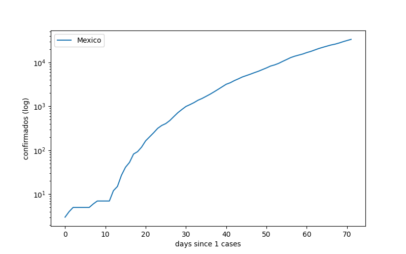
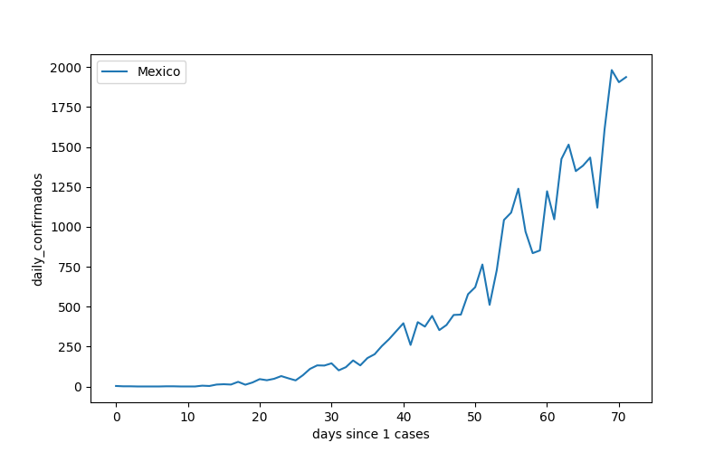
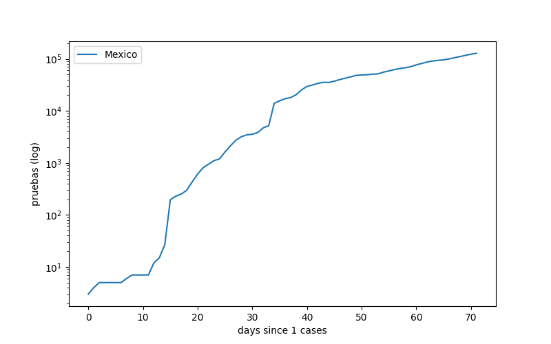
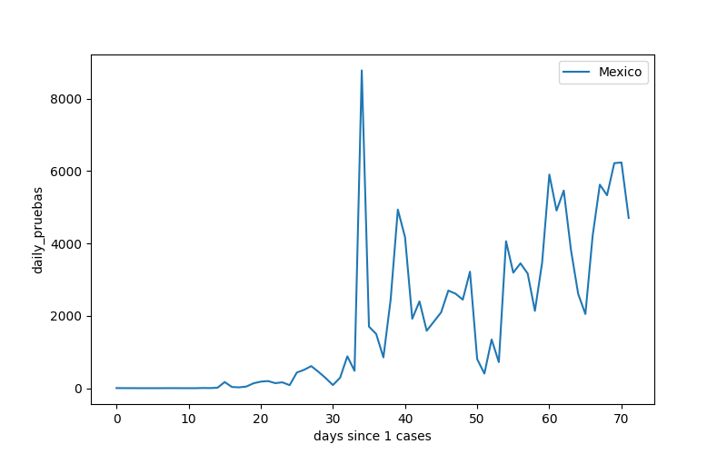

# Datos sobre COVID-19 en México al 15-04-2020

## Resumen de Resultados al 15-04-2020

- **Casos confirmados:** 5847, 448 más que el día anterior
- **Fallecimientos:** 449, 43 más que el día anterior

## Nacional

### Confirmados

#### Acumulados:

| Date                |   Mexico |
|:--------------------|---------:|
| 2020-04-02 00:00:00 |     1510 |
| 2020-04-03 00:00:00 |     1688 |
| 2020-04-04 00:00:00 |     1890 |
| 2020-04-05 00:00:00 |     2143 |
| 2020-04-06 00:00:00 |     2439 |
| 2020-04-07 00:00:00 |     2785 |
| 2020-04-08 00:00:00 |     3181 |
| 2020-04-09 00:00:00 |     3441 |
| 2020-04-10 00:00:00 |     3844 |
| 2020-04-11 00:00:00 |     4219 |
| 2020-04-12 00:00:00 |     4661 |
| 2020-04-13 00:00:00 |     5014 |
| 2020-04-14 00:00:00 |     5399 |
| 2020-04-15 00:00:00 |     5847 |

#### Diarios:

| Date                |   Mexico |
|:--------------------|---------:|
| 2020-04-02 00:00:00 |      132 |
| 2020-04-03 00:00:00 |      178 |
| 2020-04-04 00:00:00 |      202 |
| 2020-04-05 00:00:00 |      253 |
| 2020-04-06 00:00:00 |      296 |
| 2020-04-07 00:00:00 |      346 |
| 2020-04-08 00:00:00 |      396 |
| 2020-04-09 00:00:00 |      260 |
| 2020-04-10 00:00:00 |      403 |
| 2020-04-11 00:00:00 |      375 |
| 2020-04-12 00:00:00 |      442 |
| 2020-04-13 00:00:00 |      353 |
| 2020-04-14 00:00:00 |      385 |
| 2020-04-15 00:00:00 |      448 |

### Fallecimientos

#### Acumulados:

| Date                |   Mexico |
|:--------------------|---------:|
| 2020-04-02 00:00:00 |       50 |
| 2020-04-03 00:00:00 |       60 |
| 2020-04-04 00:00:00 |       79 |
| 2020-04-05 00:00:00 |       94 |
| 2020-04-06 00:00:00 |      125 |
| 2020-04-07 00:00:00 |      141 |
| 2020-04-08 00:00:00 |      174 |
| 2020-04-09 00:00:00 |      194 |
| 2020-04-10 00:00:00 |      233 |
| 2020-04-11 00:00:00 |      273 |
| 2020-04-12 00:00:00 |      296 |
| 2020-04-13 00:00:00 |      332 |
| 2020-04-14 00:00:00 |      406 |
| 2020-04-15 00:00:00 |      449 |

#### Diarios:

| Date                |   Mexico |
|:--------------------|---------:|
| 2020-04-02 00:00:00 |       13 |
| 2020-04-03 00:00:00 |       10 |
| 2020-04-04 00:00:00 |       19 |
| 2020-04-05 00:00:00 |       15 |
| 2020-04-06 00:00:00 |       31 |
| 2020-04-07 00:00:00 |       16 |
| 2020-04-08 00:00:00 |       33 |
| 2020-04-09 00:00:00 |       20 |
| 2020-04-10 00:00:00 |       39 |
| 2020-04-11 00:00:00 |       40 |
| 2020-04-12 00:00:00 |       23 |
| 2020-04-13 00:00:00 |       36 |
| 2020-04-14 00:00:00 |       74 |
| 2020-04-15 00:00:00 |       43 |

### Pruebas realizadas

#### Acumuladas:

| Date                |   Mexico |
|:--------------------|---------:|
| 2020-04-02 00:00:00 |    13985 |
| 2020-04-03 00:00:00 |    15686 |
| 2020-04-04 00:00:00 |    17184 |
| 2020-04-05 00:00:00 |    18034 |
| 2020-04-06 00:00:00 |    20475 |
| 2020-04-07 00:00:00 |    25410 |
| 2020-04-08 00:00:00 |    29578 |
| 2020-04-09 00:00:00 |    31496 |
| 2020-04-10 00:00:00 |    33893 |
| 2020-04-11 00:00:00 |    35479 |
| 2020-04-12 00:00:00 |    35301 |
| 2020-04-13 00:00:00 |    37395 |
| 2020-04-14 00:00:00 |    40091 |
| 2020-04-15 00:00:00 |    42702 |

#### Diarios:

| Date                |   Mexico |
|:--------------------|---------:|
| 2020-04-02 00:00:00 |     1707 |
| 2020-04-03 00:00:00 |     1701 |
| 2020-04-04 00:00:00 |     1498 |
| 2020-04-05 00:00:00 |      850 |
| 2020-04-06 00:00:00 |     2441 |
| 2020-04-07 00:00:00 |     4935 |
| 2020-04-08 00:00:00 |     4168 |
| 2020-04-09 00:00:00 |     1918 |
| 2020-04-10 00:00:00 |     2397 |
| 2020-04-11 00:00:00 |     1586 |
| 2020-04-12 00:00:00 |     -178 |
| 2020-04-13 00:00:00 |     2094 |
| 2020-04-14 00:00:00 |     2696 |
| 2020-04-15 00:00:00 |     2611 |

